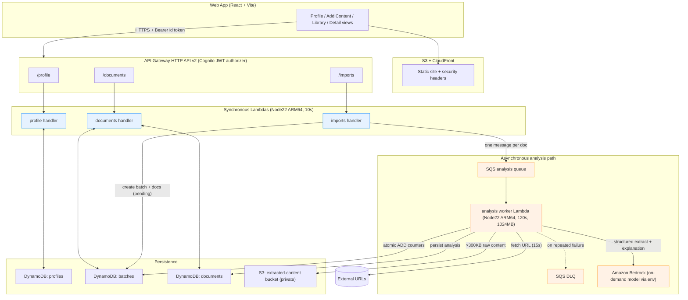

# Design Document — Knowledge Inbox Zero

## Overview

Knowledge Inbox Zero reduces a user's reading backlog by identifying the small subset of documents that deserve attention and explaining, per document, **what is materially new** and **why it matters to this user**. The product metric is **attention saved**, not content stored, and its central computation is **Marginal Knowledge Value (MKV)**: how much a document adds _given what this user already knows_.

This design is built on the existing serverless monorepo starter and reuses its conventions verbatim. It does not redesign the foundation; it replaces the example `Item`/`Share` domain with the Knowledge Inbox Zero domain while keeping the `users` (Cognito admin) domain intact.

### Design goals

1. **Attention-first.** Every persisted document carries a single recommendation state, a numeric MKV, and a written explanation. The library groups by state and surfaces attention saved as the primary metric (Req 6, 7, 8).
2. **Deterministic where possible, LLM only where necessary.** Canonicalization, dedup, metadata, and MKV math are pure deterministic functions. Bedrock is invoked only for structured extraction and the written explanation (Req 4.8, NFR-1.3). This is the single biggest cost lever.
3. **Never hold a request open.** Import returns within 3 seconds; all multi-document analysis runs asynchronously (NFR-2, Req 3.1).
4. **Graceful degradation.** A bad URL never fails the batch; the system produces a recommendation from whatever it obtained (Req 3.6, 4.5, NFR-5).
5. **Vertical-slice deployability.** Each increment keeps `npm run build` and `npm run validate` green (NFR-4.3).
6. **Per-user privacy.** Every read/write is scoped to the authenticated Cognito `sub` (Req 1.6, 7.6, NFR-3).

### Resolved decisions (up front; full rationale in §12)

- **OD-1 Taxonomy:** Adopt a **reduced 3-state core** — `READ`, `SKIM`, `SKIP` — with orthogonal explanatory **tags** (`REDUNDANT`, `OUTDATED`, `REFERENCE`, `FRESH`). Exactly one state per document (CP-9); tags are advisory.
- **OD-2 Embeddings:** **No vector DB in V1.** Novelty/Redundancy are computed by deterministic concept-set overlap. Embeddings remain Tier B behind a feature flag.
- **OD-3 Async:** **SQS (standard) + worker Lambda**, with a DLQ and partial-batch-failure reporting. Batch counters updated with atomic DynamoDB `ADD`. Batch-finished detected when `pending + processing == 0`.
- **OD-4 Limit:** Confirm **500 URLs per batch**.
- **OD-5 Retrieval:** **Simple `fetch` + Mozilla Readability extraction**, no headless browser. Degrade gracefully to metadata-only.

---

## Architecture



### Sync vs async boundary (NFR-2, Req 3.1)

The **only** synchronous work the `imports` handler performs is: validate, canonicalize, dedup, create the `Batch` record with initial counters, create the `Document` records in `pending`, and enqueue one SQS message per new document. It returns `201` with the batch id in well under 3 seconds. All fetching, LLM extraction, scoring, and explanation happen in the worker Lambda triggered by SQS. The Web App observes progress by polling `GET /imports/{batchId}` (Req 3.5, 8.11).

---

## Components and Interfaces

One Lambda handler per domain, following the `items.ts` routing style (a single `handler` that dispatches on `event.httpMethod` and path parameters). Handlers use `authenticate(event)`, `parseBody(event, schema)`, and the `response.ts` helpers. `ctx.sub` is the owner id on every query.

### 1. `profile` handler (`backend/src/handlers/profile.ts`)

Responsibility: CRUD for the single per-user `Profile`. Enforces the 100-entry / 200-char / 5000-char bounds (Req 1) via `parseBody(event, profileSchema)`.

| Method | Path       | Behavior                                                                                                                   | Reqs                    |
| ------ | ---------- | -------------------------------------------------------------------------------------------------------------------------- | ----------------------- |
| GET    | `/profile` | Return the caller's profile; if none, return the empty not-yet-configured profile (`notConfigured: true`, all lists empty) | 1.2, 1.4                |
| PUT    | `/profile` | Validate, trim list entries and drop empties, replace all fields, set server `updatedAt` (UTC)                             | 1.1, 1.3, 1.5, 1.7, 1.8 |

Concurrency (Req 1.9): a single item keyed by `userId`; last server-processed write wins. We stamp `updatedAt = now()` server-side (never trust client time). Reads always return the last persisted item, which is the last-arriving write.

### 2. `imports` handler (`backend/src/handlers/imports.ts`)

Responsibility: create batches from pasted URLs, enqueue analysis, and serve batch progress. Purely deterministic; never calls Bedrock.

| Method | Path                 | Behavior                                                                                                                                                                                                                                           | Reqs              |
| ------ | -------------------- | -------------------------------------------------------------------------------------------------------------------------------------------------------------------------------------------------------------------------------------------------- | ----------------- |
| POST   | `/imports`           | Normalize lines, reject empty/over-500, canonicalize + dedup within submission and against the user's existing documents, create `Batch` + new `Document`s (pending), enqueue one message per **new** document, return batch id + counts within 3s | 2.1–2.8, 3.1, 3.2 |
| GET    | `/imports/{batchId}` | Return batch counts + status for polling                                                                                                                                                                                                           | 3.3, 8.11         |
| GET    | `/imports`           | List the caller's batches (byOwner GSI), newest first                                                                                                                                                                                              | 7.1               |

### 3. `documents` handler (`backend/src/handlers/documents.ts`)

Responsibility: the library and document detail reads. Deterministic; never calls Bedrock.

| Method | Path                      | Behavior                                                                                                                                                                                            | Reqs                    |
| ------ | ------------------------- | --------------------------------------------------------------------------------------------------------------------------------------------------------------------------------------------------- | ----------------------- |
| GET    | `/documents`              | Library: return the caller's documents grouped with per-state counts + total (over the whole owned set), page of ≤100 with a `nextCursor`; optional `?state=` filter validated against the taxonomy | 7.2, 7.3, 7.4, 7.5, 7.7 |
| GET    | `/documents/{documentId}` | Detail: metadata, summary, scores, state, explanation; 404 if missing or not owned                                                                                                                  | 7.8, 7.9                |

The per-state counts are maintained as a lightweight aggregate so they always reflect the entire owned set regardless of pagination (see Data Models — the `counts` aggregate item).

### 4. `analysis-worker` Lambda (`backend/src/handlers/analysis-worker.ts`)

Not exposed via API Gateway; triggered by the SQS analysis queue with partial-batch-failure response enabled. Responsibility: the full per-document pipeline (fetch → extract → score → explain → persist → update counters). This is the only component that invokes Bedrock and S3. It reuses `@app/shared` scoring functions so the exact same code is unit- and property-tested (see §10). Timeout 120s (Req 3.9), memory 1024MB, reserved concurrency capped to bound Bedrock throughput/cost.

---

## Data Models

Three new tables (one per entity), each PAY_PER_REQUEST, `DEFAULT` encryption, PITR on, `RemovalPolicy.RETAIN` — identical settings to the existing `storage-stack.ts`. Plus one private S3 bucket for offloaded content.

### DynamoDB tables

**`profiles`** — one item per user.

- PK: `userId` (= Cognito `sub`). No SK, no GSI.

**`batches`** — one item per import batch.

- PK: `batchId`.
- GSI `byOwner`: PK `ownerId`, SK `createdAt` (list newest-first).

**`documents`** — one item per canonical URL per owner, plus per-owner aggregate count items.

- PK: `documentId` (deterministic: `sha256(ownerId + '#' + canonicalUrl)`, see §5). This makes re-import an idempotent upsert (CP-3).
- GSI `byOwner`: PK `ownerId`, SK `documentId` — full library page + pagination cursor.
- GSI `byOwnerState`: PK `ownerId`, SK `recommendationState#documentId` — filter by state (Req 7.4) without a table scan.
- GSI `byBatch`: PK `batchId`, SK `documentId` — worker and progress lookups.
- **Counts aggregate item** (same table, sentinel key): `documentId = "COUNTS#<ownerId>"` holding `{ total, READ, SKIM, SKIP }`. Updated with atomic `ADD` when a document reaches a terminal state so library counts are O(1) and pagination-independent (Req 7.2, 7.7).

Rejected entries (Req 2.4) are stored on the `Batch` item as a bounded `rejected: {line, reason}[]` array (capped; a batch is ≤500 lines so this fits comfortably in one item).

### `@app/shared` TypeScript interfaces

```ts
// constants.ts additions
export const RECOMMENDATION_STATE = ['READ', 'SKIM', 'SKIP'] as const;
export type RecommendationState = (typeof RECOMMENDATION_STATE)[number];

export const RECOMMENDATION_TAG = ['REDUNDANT', 'OUTDATED', 'REFERENCE', 'FRESH'] as const;
export type RecommendationTag = (typeof RECOMMENDATION_TAG)[number];

export const DIFFICULTY = ['INTRO', 'INTERMEDIATE', 'ADVANCED', 'EXPERT'] as const;
export type Difficulty = (typeof DIFFICULTY)[number];

export const DOC_STATUS = ['pending', 'processing', 'completed', 'failed'] as const;
export type DocStatus = (typeof DOC_STATUS)[number];

export const BATCH_STATUS = ['processing', 'finished'] as const;
export type BatchStatus = (typeof BATCH_STATUS)[number];

// TABLE_NAMES gains PROFILES, BATCHES, DOCUMENTS; ITEMS/SHARES removed after migration.
```

```ts
// types.ts
export interface Profile extends Timestamped {
  userId: string;
  highInterests: string[];
  mediumInterests: string[];
  currentlyResearching: string[];
  alreadyKnown: string[]; // topics/concepts the user already knows
  avoidContentTypes: string[];
  context?: string; // free text, <=5000 chars trimmed
  notConfigured?: boolean; // true only for the synthetic empty profile (Req 1.4)
}

export interface Scores {
  relevance: number; // 0..100
  novelty: number; // 0..100
  redundancy: number; // 0..100
  freshness: number; // 0..100
  mkv: number; // 0..100 overall priority
  freshnessEstimated?: boolean; // Req 5.9
}

export interface DocMetadata {
  title?: string;
  author?: string;
  sourceDomain?: string;
  publishedAt?: string; // ISO date if found
}

export interface Extraction {
  topics: string[];
  concepts: string[];
  claims: string[];
  difficulty: Difficulty;
  summary: string; // <=500 chars
  truncated?: boolean; // Req 4.6
}

export interface KnowledgeDocument extends Timestamped {
  documentId: string; // sha256(ownerId#canonicalUrl)
  ownerId: string;
  batchId: string;
  rawUrl: string;
  canonicalUrl: string;
  status: DocStatus;
  degraded?: boolean; // Req 4.5
  failureReason?: string; // Req 3.6, 3.9, 4.5
  metadata?: DocMetadata;
  extraction?: Extraction;
  scores?: Scores;
  recommendationState?: RecommendationState;
  tags?: RecommendationTag[];
  explanation?: string; // 50..1500 chars, or placeholder (Req 6.6)
  explanationUnavailable?: boolean; // Req 6.6
  s3ContentRef?: string; // set when raw content >300KB (Req 4.7)
}

export interface RejectedEntry {
  line: string;
  reason: string;
}

export interface Batch extends Timestamped {
  batchId: string;
  ownerId: string;
  status: BatchStatus;
  total: number;
  pending: number;
  processing: number;
  completed: number;
  failed: number;
  rejected: RejectedEntry[];
}

export interface LibraryResponse {
  documents: KnowledgeDocument[];
  counts: Record<RecommendationState, number> & { total: number };
  nextCursor?: string;
}
```

### `@app/shared` Zod schemas

```ts
// schemas.ts
const trimmedEntry = z.string().transform((s) => s.trim());
const entryList = z
  .array(trimmedEntry)
  .transform((arr) => arr.filter((s) => s.length > 0)) // Req 1.7 drop empties
  .refine((arr) => arr.length <= 100, { message: 'At most 100 entries' }) // Req 1.8
  .refine((arr) => arr.every((s) => s.length <= 200), { message: 'Entry exceeds 200 chars' });

export const profileSchema = z.object({
  highInterests: entryList.default([]),
  mediumInterests: entryList.default([]),
  currentlyResearching: entryList.default([]),
  alreadyKnown: entryList.default([]),
  avoidContentTypes: entryList.default([]),
  context: z
    .string()
    .transform((s) => s.trim())
    .refine((s) => s.length <= 5000, {
      message: 'context exceeds 5000 characters', // Req 1.5
    })
    .optional(),
});

export const importCreateSchema = z.object({
  // Raw pasted blob; the handler splits/normalizes lines (Req 2.1).
  urls: z.string().min(1),
});

export const libraryQuerySchema = z.object({
  state: z.enum(RECOMMENDATION_STATE).optional(), // Req 7.5 invalid → 400
  cursor: z.string().optional(),
});
```

Note: validating the ≤500 count (Req 2.7) happens after line normalization in the handler, because the schema receives a single blob and the count is only known post-split. The handler returns `badRequest('Per-batch limit of 500 URLs exceeded')`.

### S3 layout (offloaded extracted content)

Private bucket `{{project}}-content-{{env}}` (Block Public Access on, `DEFAULT`/SSE-S3 encryption, `RETAIN`). Object key: `{ownerId}/{documentId}.txt`. Written **only** when raw/readable content exceeds 300KB (Req 4.7); otherwise content is discarded after extraction (we persist analysis results, not raw content, to keep DynamoDB items small). The document row stores `s3ContentRef` = the object key.

**No vector database, no OpenSearch, no embeddings store in V1** (OD-2, NFR-1.1).

---

## Low-Level Design (algorithms + signatures)

All pure functions live in `@app/shared` (or a `backend/src/lib` module that imports only pure helpers) so the identical code is exercised by property tests and by the worker.

### URL canonicalization (Req 4.1; CP-2, CP-3)

```ts
const TRACKING_PARAM_DENYLIST = [
  /^utm_/,
  /^fbclid$/,
  /^gclid$/,
  /^mc_eid$/,
  /^mc_cid$/,
  /^igshid$/,
  /^ref$/,
  /^ref_src$/,
  /^spm$/,
  /^_hsenc$/,
  /^_hsmi$/,
];
const DEFAULT_PORTS: Record<string, string> = { 'http:': '80', 'https:': '443' };

/** Deterministic + idempotent. Throws on syntactically invalid URLs. */
export function canonicalizeUrl(raw: string): string {
  let input = raw.trim();
  if (!/^[a-zA-Z][a-zA-Z0-9+.-]*:\/\//.test(input)) input = 'https://' + input; // Req 2.5
  const u = new URL(input); // throws → caller records rejected (Req 2.4)

  u.protocol = u.protocol.toLowerCase();
  u.hostname = u.hostname.toLowerCase();
  if (DEFAULT_PORTS[u.protocol] === u.port) u.port = ''; // strip default port
  u.hash = ''; // drop fragment

  // Remove tracking params, keep the rest, sort for stable output.
  const kept = [...u.searchParams.entries()]
    .filter(([k]) => !TRACKING_PARAM_DENYLIST.some((re) => re.test(k)))
    .sort(([a], [b]) => (a < b ? -1 : a > b ? 1 : 0));
  u.search = '';
  for (const [k, v] of kept) u.searchParams.append(k, v);

  // Normalize trailing slash on the path (but keep root "/").
  if (u.pathname.length > 1 && u.pathname.endsWith('/')) u.pathname = u.pathname.slice(0, -1);

  return u.toString();
}

/** Deterministic document id → re-import is an idempotent upsert (CP-3). */
export function deriveDocumentId(ownerId: string, canonicalUrl: string): string {
  return sha256Hex(`${ownerId}#${canonicalUrl}`);
}
```

Idempotence (CP-2): the operations are all deterministic normalizations; applying `canonicalizeUrl` to its own output is a no-op because scheme/host are already lowercase, ports/fragments/tracking params already removed, params already sorted, trailing slash already normalized.

### Concept-set math for novelty/redundancy (Req 5.6, 5.7; CP-7, CP-8)

```ts
/** Lowercased, trimmed, de-duplicated token set. */
export function normalizeConcepts(items: string[]): Set<string> {
  return new Set(items.map((s) => s.trim().toLowerCase()).filter(Boolean));
}

/** Fraction of the document's concepts already covered by the known set. 0..1. */
function coverage(docConcepts: Set<string>, known: Set<string>): number {
  if (docConcepts.size === 0) return 0;
  let hit = 0;
  for (const c of docConcepts) if (known.has(c)) hit++;
  return hit / docConcepts.size;
}
```

The **known set** for a user is `normalizeConcepts(profile.alreadyKnown ∪ union(priorDocumentConcepts))`. `coverage` is monotonically non-decreasing as the known set grows (adding elements can only turn misses into hits), which is exactly what CP-7 and Req 5.7 require.

### MKV scoring (Req 5; CP-1, CP-4..CP-8)

```ts
export interface ScoreInput {
  docConcepts: Set<string>;
  docTopics: Set<string>;
  interests: Set<string>; // high ∪ medium ∪ currentlyResearching
  known: Set<string>; // alreadyKnown ∪ prior document concepts
  publishedAt?: string; // ISO, optional
  now: Date; // injected for determinism/testability
  isExactPriorDuplicate: boolean; // canonicalUrl seen before (Req 5.4)
  halfLifeDays?: number; // default 180
}

const clamp100 = (n: number) => Math.max(0, Math.min(100, Math.round(n)));

export function computeRelevance(i: ScoreInput): number {
  // Overlap of doc topics/concepts with the user's interests.
  const c = coverage(new Set([...i.docConcepts, ...i.docTopics]), i.interests);
  return clamp100(c * 100);
}

export function computeRedundancy(i: ScoreInput): number {
  if (i.isExactPriorDuplicate)
    return Math.max(90, clamp100(coverage(i.docConcepts, i.known) * 100)); // Req 5.4 / CP-4
  const cov = coverage(i.docConcepts, i.known);
  const base = clamp100(cov * 100);
  // Req 5.3: all concepts known ⇒ redundancy ≥ 80.
  return cov >= 1 ? Math.max(80, base) : base;
}

export function computeNovelty(i: ScoreInput): number {
  // CP-8: exact complement of coverage ⇒ novelty and redundancy move oppositely,
  // and CP-7: growing `known` raises coverage, so novelty is non-increasing.
  const cov = coverage(i.docConcepts, i.known);
  return clamp100((1 - cov) * 100);
}

export function computeFreshness(i: ScoreInput): number {
  if (!i.publishedAt) return 50; // Req 5.9 (caller also sets freshnessEstimated=true)
  const ageDays = Math.max(0, (i.now.getTime() - Date.parse(i.publishedAt)) / 86_400_000);
  const halfLife = i.halfLifeDays ?? 180;
  // Exponential half-life decay: monotonically non-increasing in age ⇒ CP-6 / Req 5.8.
  return clamp100(100 * Math.pow(0.5, ageDays / halfLife));
}

export function computeMkv(s: Scores): number {
  // Non-decreasing in relevance & novelty, non-increasing in redundancy (Req 5.5).
  // Weighted blend; redundancy enters via its complement to guarantee monotonicity.
  const mkv = 0.45 * s.relevance + 0.35 * s.novelty + 0.2 * (100 - s.redundancy);
  return clamp100(mkv);
}
```

Monotonicity proofs are structural: `computeMkv` is a non-negative-weighted sum of `relevance`, `novelty`, and `(100 - redundancy)`, so increasing relevance or novelty cannot decrease it and increasing redundancy cannot increase it (Req 5.5). `computeNovelty = 100·(1 − coverage)` and `computeRedundancy` (non-dup branch) `= 100·coverage`; both derive from the same `coverage`, so they move in opposite directions (CP-8) and novelty is non-increasing as `known` grows (CP-7). Freshness is `100·0.5^(age/halfLife)`, strictly non-increasing in age (CP-6).

### Recommendation state mapping (Req 6.1; CP-5, CP-9)

```ts
export interface StateResult {
  state: RecommendationState;
  tags: RecommendationTag[];
}

/** Deterministic; always returns exactly one state (CP-9). */
export function scoresToRecommendationState(
  s: Scores,
  ctx: {
    isExactPriorDuplicate: boolean;
    publishedAt?: string;
    now: Date;
  }
): StateResult {
  const tags: RecommendationTag[] = [];
  const fullyRedundant = s.redundancy >= 80;
  if (fullyRedundant) tags.push('REDUNDANT');
  if (s.freshness < 25) tags.push('OUTDATED');
  if (s.freshness >= 75) tags.push('FRESH');

  // CP-5: a fully-redundant doc cannot be treated as high-novelty READ.
  // Its high redundancy has already suppressed novelty (CP-8) and thus mkv,
  // so the ordinary thresholds below naturally route it to SKIP. No override needed.
  let state: RecommendationState;
  if (fullyRedundant || s.mkv < 34) state = 'SKIP';
  else if (s.mkv < 67) state = 'SKIM';
  else state = 'READ';

  if (state !== 'READ' && s.relevance >= 70 && s.novelty < 40) tags.push('REFERENCE');
  return { state, tags };
}
```

CP-5 is enforced by construction: novelty and redundancy are complements over the same coverage, so a document cannot be simultaneously fully redundant (`redundancy ≥ 80`) and maximally novel; and the mapping never routes a fully-redundant document to `READ`. No override path exists in V1, which trivially satisfies "unless an explicit documented override is recorded."

### Bedrock extraction contract (Req 4.3, 4.8, NFR-1.2)

Single provider (Bedrock on-demand). Model id from `BEDROCK_MODEL_ID` env var (configurable model, no multi-provider abstraction — NFR-1.2, OD stretch B4 deferred). Deterministic-vs-LLM split: canonicalization, dedup, metadata parsing, and all scoring are deterministic; the LLM produces only the structured `Extraction` and the written `explanation`.

```ts
interface ExtractionRequest {
  text: string;
} // cleaned readable text, already truncated to 200k

// Enforced output — validated with Zod; parse failure → retry (bounded), then Degraded.
const extractionResponseSchema = z.object({
  topics: z.array(z.string()).max(50),
  concepts: z.array(z.string()).max(100),
  claims: z.array(z.string()).max(50),
  difficulty: z.enum(DIFFICULTY),
  summary: z.string().max(500),
});

async function bedrockExtract(req: ExtractionRequest): Promise<Extraction> {
  // Prompt instructs: "Return ONLY minified JSON matching this shape …".
  // Response is parsed; on JSON/Zod failure we retry up to 2 times with a
  // stricter reminder, then throw → pipeline marks Degraded (Req 4.5).
}

async function bedrockExplain(input: {
  extraction: Extraction;
  scores: Scores;
  state: RecommendationState;
  profile: Profile;
  tags: RecommendationTag[];
}): Promise<string> {
  // Produces 50..1500 chars covering (a) why it matters, (b) what is new,
  // (c) why this state (Req 6.2). On failure/short output → placeholder (Req 6.6).
}
```

### Content retrieval + readability (Req 4.2, 4.4, 4.5; OD-5)

```ts
async function retrieveReadable(url: string): Promise<{
  html?: string;
  text?: string;
  metadata: DocMetadata;
  degraded: boolean;
  reason?: string;
}> {
  const ctrl = new AbortController();
  const t = setTimeout(() => ctrl.abort(), 15_000); // Req 4.4
  try {
    const res = await fetch(url, { signal: ctrl.signal, redirect: 'follow' });
    const type = res.headers.get('content-type') ?? '';
    if (!res.ok) return { metadata: domainOnly(url), degraded: true, reason: `http_${res.status}` };
    if (!/text\/html|text\//.test(type))
      // Req 4.5 non-HTML/text
      return { metadata: domainOnly(url), degraded: true, reason: 'unparseable_content_type' };
    const html = await res.text();
    const { text, metadata } = readabilityExtract(html, url); // @mozilla/readability + jsdom
    if (!text?.trim()) return { metadata, degraded: true, reason: 'no_readable_text' };
    return { html, text, metadata, degraded: false };
  } catch (e) {
    return {
      metadata: domainOnly(url),
      degraded: true,
      reason: isAbort(e) ? 'timeout' : 'fetch_failed',
    };
  } finally {
    clearTimeout(t);
  }
}
```

New dependencies (justified per repo rule): `@mozilla/readability` + `jsdom` for robust main-content extraction from arbitrary HTML. Rationale: reimplementing readability is error-prone; these are the de-facto libraries and run fine in Lambda. No headless browser (Puppeteer/Chromium) in V1 — it multiplies cold-start, memory, and cost for marginal coverage of JS-only pages, which we deliberately degrade instead (OD-5, NFR-5).

### Analysis worker pipeline (Req 3.6, 3.7, 3.9, 4.*)

```ts
// SQS record → { batchId, documentId, ownerId, canonicalUrl, rawUrl }
async function processDocument(msg: AnalysisMessage): Promise<void> {
  await setDocStatus(msg, 'processing'); // triggers a counter move pending→processing
  try {
    const profile = await getProfile(msg.ownerId);
    const priorConcepts = await getPriorConcepts(msg.ownerId, msg.documentId);
    const isDup = await isExactPriorDuplicate(msg.ownerId, msg.canonicalUrl, msg.documentId);

    const got = await retrieveReadable(msg.canonicalUrl); // 15s
    let extraction: Extraction | undefined;
    let degraded = got.degraded;
    if (got.text) {
      let text = got.text;
      let truncated = false;
      if (text.length > 200_000) {
        text = text.slice(0, 200_000);
        truncated = true;
      } // Req 4.6
      try {
        extraction = { ...(await bedrockExtract({ text })), truncated };
      } catch {
        degraded = true;
      }
      if ((got.html?.length ?? 0) > 300_000 || text.length > 300_000)
        // Req 4.7
        await putContentToS3(msg, got.text);
    }

    const scores = scoreDocument({
      extraction,
      profile,
      priorConcepts,
      publishedAt: got.metadata.publishedAt,
      isDup,
      now: new Date(),
    });
    const { state, tags } = scoresToRecommendationState(scores, {
      isExactPriorDuplicate: isDup,
      publishedAt: got.metadata.publishedAt,
      now: new Date(),
    });

    let explanation: string;
    let explanationUnavailable = false;
    try {
      explanation = await bedrockExplain({ extraction: extraction!, scores, state, profile, tags });
      if (explanation.trim().length < 50) throw new Error('too short');
    } catch {
      explanation = 'Explanation unavailable; recommendation and scores were still computed.';
      explanationUnavailable = true;
    } // Req 6.6

    await persistCompleted(msg, {
      metadata: got.metadata,
      extraction,
      scores,
      state,
      tags,
      explanation,
      explanationUnavailable,
      degraded,
    });
    await moveCounters(msg.batchId, { from: 'processing', to: 'completed' });
    await bumpStateCount(msg.ownerId, state);
  } catch (err) {
    // SQS redrive gives us the up-to-3 transient retries (Req 3.7); on final
    // failure the record lands in the DLQ AND we mark the doc failed here first.
    await markFailed(msg, reasonOf(err)); // Req 3.6
    await moveCounters(msg.batchId, { from: 'processing', to: 'failed' });
    await maybeFinishBatch(msg.batchId);
    throw err; // let SQS decide retry vs DLQ
  }
  await maybeFinishBatch(msg.batchId);
}
```

The 120s document timeout (Req 3.9) is the Lambda's own timeout; the SQS message visibility timeout is set to ≥ 6× the Lambda timeout per AWS guidance. Transient retries (Req 3.7 — up to 3) are the queue's `maxReceiveCount = 3` before redrive to the DLQ.

### Atomic batch counters (Req 2.2, 3.3, 3.8, 3.10; CP-10)

```ts
// pending → processing
UpdateExpression: 'ADD pending :neg1, processing :one';
// processing → completed
UpdateExpression: 'ADD processing :neg1, completed :one';
// processing → failed
UpdateExpression: 'ADD processing :neg1, failed :one';
// values: { ':neg1': -1, ':one': 1 }
```

`total` is written once at creation and never touched again (CP-10). Because every move decrements one counter and increments another by the same amount, the invariant `pending + processing + completed + failed == total` is preserved atomically by DynamoDB.

```ts
async function maybeFinishBatch(batchId: string) {
  const b = await getBatch(batchId);
  if (b.status !== 'finished' && b.pending === 0 && b.processing === 0) {
    // Conditional update guards against double-finish under concurrency.
    await update(batchId, {
      set: { status: 'finished', finishedAt: now() }, // Req 3.8, 3.10
      condition: 'attribute_exists(batchId) AND pending = :z AND processing = :z',
    });
  }
}
```

Finished is detected whenever a worker observes `pending == 0 && processing == 0` after its own terminal move; the conditional write makes the transition idempotent (Req 3.8, 3.10).

---

## API Surface

All routes require a valid Cognito id token (HTTP API JWT authorizer, as in the existing `api-stack.ts`). All bodies validated with `parseBody`; all responses via `response.ts` helpers.

| Method | Path                      | Auth | Request              | Response                                                 | Reqs                    |
| ------ | ------------------------- | ---- | -------------------- | -------------------------------------------------------- | ----------------------- |
| GET    | `/profile`                | user | –                    | `Profile` (or empty `notConfigured`)                     | 1.2, 1.4                |
| PUT    | `/profile`                | user | `profileSchema`      | `Profile`                                                | 1.1, 1.3, 1.5, 1.7, 1.8 |
| POST   | `/imports`                | user | `importCreateSchema` | `201 { batchId, total, pending, rejected }`              | 2.*, 3.1, 3.2           |
| GET    | `/imports`                | user | –                    | `Batch[]` (byOwner)                                      | 7.1                     |
| GET    | `/imports/{batchId}`      | user | –                    | `Batch` (counts + status)                                | 3.3, 8.11               |
| GET    | `/documents`              | user | `?state=&cursor=`    | `LibraryResponse` (grouped counts + page + `nextCursor`) | 7.2–7.5, 7.7            |
| GET    | `/documents/{documentId}` | user | –                    | `KnowledgeDocument` detail                               | 7.8, 7.9                |

`users` admin routes remain exactly as today (kept from the foundation).

---

## Infrastructure Changes (CDK)

Naming via `ResourceNaming` (`{project}-{domain}-{env}`, SSM `/{project}/{env}/{domain}`). Keep ARM64 / Node 22 / active tracing / `externalModules: ['@aws-sdk/*']`.

**`storage-stack.ts`** — add three tables + the content bucket:

- `profiles` (PK `userId`).
- `batches` (PK `batchId`) + GSI `byOwner` (PK `ownerId`, SK `createdAt`).
- `documents` (PK `documentId`) + GSIs `byOwner` (PK `ownerId`, SK `documentId`), `byOwnerState` (PK `ownerId`, SK `stateKey`), `byBatch` (PK `batchId`, SK `documentId`).
- S3 `content` bucket: Block Public Access, SSE-S3, `RETAIN`, no public policy.
- Remove `items`/`shares` tables **after** the new domain ships (migration step, not now).

**`api-stack.ts`** — add three sync Lambdas + routes and the worker + queue:

- `profileFn` → `/profile` (GET, PUT); `grantReadWriteData(profiles)`.
- `importsFn` → `/imports`, `/imports/{batchId}` (GET, POST); `grantReadWriteData(batches)`, `grantReadWriteData(documents)` + `grantQueryIndexes` for `byOwner`; `queue.grantSendMessages`.
- `documentsFn` → `/documents`, `/documents/{documentId}` (GET); `grantReadData(documents)` + `grantQueryIndexes` for `byOwner`, `byOwnerState`.
- `analysisWorkerFn`: SQS event source (batch size 1–5, `reportBatchItemFailures`), timeout 120s, memory 1024MB, reserved concurrency (e.g. 5) to cap Bedrock spend. Grants: `grantReadWriteData(documents)` + `grantReadWriteData(batches)`, `grantReadData(profiles)`, content bucket `grantReadWrite`, and an IAM statement for `bedrock:InvokeModel` scoped to the configured model ARN. Env: `BEDROCK_MODEL_ID`, table names, bucket name, `EMBEDDINGS_ENABLED=false`.
- SQS `analysis` queue + `analysis-dlq` (`maxReceiveCount: 3`, Req 3.7). Visibility timeout ≥ 6× worker timeout.
- GSI query grants reuse the existing `grantQueryIndexes` helper pattern.

No always-on compute; no NAT (Lambdas stay outside VPC to reach the public internet and Bedrock without a NAT gateway cost).

---

## Cost Analysis (NFR-1)

- **Bedrock tokens dominate.** One structured-extraction call + one explanation call per _successfully fetched_ document. Deterministic-first (Req 4.8) means degraded/duplicate/failed documents skip or minimize LLM calls. Truncation to 200k chars (Req 4.6) bounds worst-case input tokens. Reserved worker concurrency caps parallel model spend.
- **DynamoDB PAY_PER_REQUEST**: a handful of small reads/writes per document; negligible at tens-to-hundreds-per-user scale (NFR-1.4).
- **SQS + Lambda**: fractions of a cent per batch; the worker runs only while there is work (no idle cost).
- **S3**: only >300KB documents are stored; typical article text is far smaller, so most documents store nothing in S3.
- **No idle-dominant infra**: no RDS, ECS/EKS, OpenSearch, or vector store (NFR-1.1, OD-2).

The chosen SQS+Lambda async path is the cheapest reliable option; Step Functions Standard would add per-state-transition charges that scale with hundreds of URLs, and Express caps at 5 minutes with weaker per-item visibility (see §12).

---

## Privacy & Security (NFR-3, Req 1.6/7.6)

- Every query is keyed or filtered by `ownerId == ctx.sub`; no cross-user reads. Document detail returns 404 for non-owned ids (Req 7.9).
- Content bucket is fully private (Block Public Access), objects keyed under `{ownerId}/…`; the worker uses least-privilege grants and reads/writes only within the bucket.
- IAM is least-privilege: `bedrock:InvokeModel` scoped to one model ARN; DynamoDB grants per table + explicit GSI query statements; SQS send/consume split between producer and consumer.
- **No personal data in the repo** (NFR-3.2): ship a clearly-synthetic `examples/sample-profile.json` and `examples/sample-urls.txt` (fictional interests, public documentation URLs), documented as demo-only. A hook can guard against accidental personal-data commits (§11).
- Secrets: none in code; model id and table/bucket names come from env injected by CDK.

---

## Correctness Properties

_A property is a characteristic or behavior that should hold true across all valid executions of a system — essentially, a formal statement about what the system should do. Properties serve as the bridge between human-readable specifications and machine-verifiable correctness guarantees._

These properties are derived from the acceptance-criteria prework and map onto the requirements' CP-1..CP-11 plus a few requirement-specific invariants. Each is implemented by a single property-based test (fast-check) running ≥100 iterations and tagged `Feature: knowledge-inbox-zero, Property N: <text>`.

### Property 1: Score bounds (CP-1)

_For all_ score inputs, `computeRelevance`, `computeNovelty`, `computeRedundancy`, `computeFreshness`, and `computeMkv` each return an integer within the inclusive range 0 to 100.

**Validates: Requirements 5.1**

### Property 2: Idempotent, deterministic canonicalization (CP-2)

_For any_ raw URL `u` that canonicalizes successfully, `canonicalizeUrl(canonicalizeUrl(u)) === canonicalizeUrl(u)`, and canonicalizing the same input always yields the same output.

**Validates: Requirements 4.1, 2.5**

### Property 3: No duplicate documents (CP-3)

_For any_ owner and _any_ set of raw URLs, importing URLs that share a Canonical_URL — whether within one submission or across separate imports — never yields more than one Document per Canonical_URL (the derived `documentId` collides deterministically).

**Validates: Requirements 2.6, 2.8**

### Property 4: Exact duplicates are not low-redundancy (CP-4)

_For any_ Document whose Canonical_URL exactly matches a previously analyzed Document, `computeRedundancy` returns a value ≥ 90.

**Validates: Requirements 5.4**

### Property 5: Redundant implies not maximally novel (CP-5)

_For any_ score input, if `computeRedundancy` is at its maximum then `computeNovelty` is not simultaneously at its maximum, and the state mapping never routes a fully-redundant Document (redundancy ≥ 80) to `READ`.

**Validates: Requirements 5.6, 6.1**

### Property 6: Age never improves freshness (CP-6)

_For any_ two Documents identical in all scoring inputs except publication date, the Document with the older publication date receives a `computeFreshness` value less than or equal to that of the newer Document.

**Validates: Requirements 5.8**

### Property 7: Knowing more never increases novelty (CP-7)

_For any_ score input and _any_ superset of the known-concept set (all other inputs held constant), `computeNovelty` on the superset is less than or equal to `computeNovelty` on the original set.

**Validates: Requirements 5.7**

### Property 8: Novelty/redundancy complementarity (CP-8)

_For any_ document-concept set and known-concept set, increasing the detected overlap never increases `computeNovelty` and never decreases `computeRedundancy`; the two move in opposite directions.

**Validates: Requirements 5.6**

### Property 9: Single recommendation state (CP-9)

_For any_ Scores object, `scoresToRecommendationState` returns exactly one value from the defined taxonomy (it is a total function over its input domain).

**Validates: Requirements 6.1**

### Property 10: Batch count conservation (CP-10)

_For any_ Batch created from a submission and _any_ sequence of valid status transitions applied afterward, `pending + processing + completed + failed` always equals `total`, `total` never changes after creation, and the Batch is marked finished if and only if `pending + processing == 0`.

**Validates: Requirements 2.2, 3.3, 3.8, 3.10**

### Property 11: Round-trip persistence (CP-11)

_For any_ analyzed Document, writing it to storage and reading it back produces an equivalent object with no loss of scores, Recommendation_State, tags, or explanation.

**Validates: Requirements 6.7, 7.1**

### Property 12: MKV monotonicity

_For any_ two Scores objects differing in a single dimension, `computeMkv` is non-decreasing as relevance increases, non-decreasing as novelty increases, and non-increasing as redundancy increases.

**Validates: Requirements 5.5**

### Property 13: All-known implies high redundancy

_For any_ Document whose concept set is a subset of the known-concept set, `computeRedundancy` returns a value ≥ 80.

**Validates: Requirements 5.3**

### Property 14: Missing date yields neutral estimated freshness

_For any_ Document with no publication date, `computeFreshness` returns 50 and the `freshnessEstimated` flag is set.

**Validates: Requirements 5.9**

### Property 15: Import line partition

_For any_ pasted blob, every accepted entry is a syntactically valid (post-normalization) URL and every rejected entry is recorded with a reason, no line is both accepted and rejected, and blank/whitespace-only lines are discarded.

**Validates: Requirements 2.1, 2.4**

### Property 16: Library grouping and pagination integrity

_For any_ owned Document set, the per-state counts and total reflect the entire set regardless of pagination; paging through with the continuation token yields pages of at most 100 whose union equals the full set with no duplicates or omissions; filtering by a state returns only owned Documents in that state.

**Validates: Requirements 7.2, 7.3, 7.4, 7.7**

---

## Error Handling

- **Validation (400):** `parseBody` returns `badRequest` with a formatted Zod message (`zod-errors.ts`). Post-normalization batch-size (>500) and empty-submission checks return `badRequest` from the handler (Req 2.3, 2.7).
- **Auth (401/403):** `authenticate` returns `unauthorized` when the token is missing/invalid. Ownership mismatches on detail reads return `notFound` (Req 7.9) so existence is not leaked.
- **Not found (404):** `notFound('Document' | 'Batch')`.
- **Retrieval failures (degraded, not error):** any fetch/parse failure (timeout, non-HTML, dead link, empty text) sets `degraded=true`, records `failureReason`, and continues to scoring with metadata only (Req 4.5, NFR-5). The document still reaches `completed`.
- **LLM failures:** extraction parse/validation failure → bounded retry (2×) → mark degraded. Explanation failure or <50 chars → persist scores/state with a placeholder and `explanationUnavailable=true` (Req 6.6).
- **Worker failures:** unexpected exceptions mark the document `failed` with a reason, move counters, then rethrow so SQS applies redrive (up to 3 receives → DLQ, Req 3.7). One failing document never blocks the batch (Req 3.6); `maybeFinishBatch` still fires (Req 3.10).
- **Server errors (500):** `serverError(err)` logs a structured error with stack to CloudWatch and returns a generic message.
- **Batch timeout (Req 3.9):** the 120s Lambda timeout terminates a stuck document; the redriven message eventually marks it `failed` with a timeout reason.

---

## Testing Strategy

Dual approach: property-based tests for universal invariants, example/edge tests for specific behavior, and a thin layer of integration tests for orchestration and timing.

### Property-based testing (backend)

- **Library:** `fast-check` — added as a **backend dev dependency** (justified new library: it is the standard TypeScript PBT tool; we do not hand-roll property testing). Runs under the existing Jest/ts-jest setup.
- **Configuration:** each property test runs ≥100 iterations (`fc.assert(fc.property(...), { numRuns: 100 })`), references its design property via a comment tag `Feature: knowledge-inbox-zero, Property N: <text>`, and implements exactly one property.
- **Generators:**
  - URLs: compose scheme (present/absent), host case, default/non-default ports, tracking + non-tracking query params in random order, fragments, trailing slashes → for Properties 2, 3, 15.
  - Concept sets: `fc.array(fc.string())` mapped through `normalizeConcepts`; plus a superset generator (base set ∪ extra) for Property 7.
  - Score inputs: arbitrary coverage ratios and interest overlaps for Properties 1, 4, 5, 8, 12, 13; publication-date pairs (including missing) for Properties 6, 14.
  - Transition sequences: random permutations of `pending→processing→{completed|failed}` moves for Property 10.
  - Document sets: arbitrary owned sets (size crossing 100) for Property 16, paged through the cursor logic.
- **Placement:** `backend/src/__tests__/*.property.test.ts`; the pure functions live in `@app/shared` (or `backend/src/lib/scoring.ts`) so tests import the exact production code.

### Example / edge-based unit tests

- Canonicalization golden cases (specific tricky URLs) alongside the idempotence property.
- State-mapping boundary cases at the 34/67 thresholds and the fully-redundant → SKIP case.
- Zod schema edge cases: context at 5000/5001 chars (Req 1.5), lists at 100/101 entries and 200/201 chars (Req 1.8), batch at 500/501 URLs (Req 2.7), invalid state filter (Req 7.5).
- Bedrock extraction: validate `extractionResponseSchema` against representative model outputs and the retry-on-parse-failure path (model mocked).
- Truncation at 200k (Req 4.6) and S3-offload at 300KB (Req 4.7) with a mocked S3 client.

### Integration tests

- Async boundary: POST `/imports` returns quickly with `pending` status (Req 3.1) — the multi-document work is not awaited.
- Resilience: a forced-failure document does not stop the batch; batch reaches `finished` with the right `failed` count (Req 3.6, 3.10).
- CDK assertions (snapshot / `Template.fromStack`): tables + GSIs exist, worker timeout is 120s, DLQ `maxReceiveCount = 3` (Req 3.7), bucket blocks public access, IAM includes `bedrock:InvokeModel`.

### Frontend tests

- Component/example tests for empty, loading, and error states of the Library view (Req 8.6, 8.7, 8.8) and for polling that stops when a batch reaches a terminal state (Req 8.11).

---

## Kiro Capability Opportunities

- **Steering:** a repo-convention steering file (one-handler-per-domain, `response.ts`/`parseBody` usage, ARM64/Node22 ESM, `@app/shared` placement) and a **cost-guardrail** steering note (deterministic-first, no always-on infra, no vector DB in V1) keep future work aligned with NFR-1/NFR-4.
- **Hooks:** (1) run the backend scoring/canonicalization tests on save of `scoring.ts`/`url.ts` so invariant regressions surface immediately; (2) a pre-commit guard that fails if a file matching the personal-data patterns (real profile/URL history) is staged, enforcing NFR-3.2.
- **PBT:** the deterministic scoring and canonicalization core is an ideal PBT target — Properties 1–16 above are the concrete plan.
- **MCP:** the AWS documentation MCP server is useful when wiring the SQS event source, partial-batch-failure response shape, and Bedrock `InvokeModel` request/response formats.

These are genuine fits; nothing here is added for its own sake.

---

## Design Decisions & Tradeoffs

- **OD-1 — Taxonomy: 3 states (READ/SKIM/SKIP) + tags.** Rationale: a user scanning a library needs one obvious next action, not a six-way quiz; REDUNDANT/OUTDATED/REFERENCE are _reasons_, not actions, so they become orthogonal tags. Rejected: the six-state taxonomy (semantic overlap between REDUNDANT/OUTDATED/DISCARD and between SKIM/REFERENCE creates ambiguous mappings and harder deterministic thresholds). The requirements are taxonomy-agnostic (exactly one state), so this satisfies Req 6.1/CP-9.
- **OD-2 — No vector DB in V1.** Rationale: at tens-to-hundreds of documents per user, deterministic concept-overlap gives explainable, reproducible Novelty/Redundancy (needed for Req 5.2 determinism and the monotonicity properties) with zero standing infrastructure cost. Rejected/deferred: embeddings + vector store (Tier B, behind `EMBEDDINGS_ENABLED`) — adds cost and non-determinism for a scale that does not require it.
- **OD-3 — SQS + worker Lambda (DLQ + partial batch failure).** Rationale: cheapest reliable fan-out; per-document isolation; built-in retry/redrive covers Req 3.7; visibility of progress comes from DynamoDB counters, not the orchestrator. Rejected: Step Functions **Standard** (per-state-transition cost scales with hundreds of URLs and adds no needed capability here) and **Express** (5-minute ceiling and weaker per-item visibility/durability). Batch progress is updated with atomic `ADD` UpdateExpressions and finished is detected via `pending + processing == 0` guarded by a conditional write (CP-10).
- **OD-4 — 500 URLs/batch confirmed.** Rationale: bounds fan-out cost and latency; comfortably holds the rejected-entries array within one DynamoDB item. Above the limit the whole submission is rejected (Req 2.7).
- **OD-5 — `fetch` + Mozilla Readability, no headless browser.** Rationale: covers the large majority of article-style pages at negligible cost; JS-only/paywalled pages degrade gracefully to metadata-only (Req 4.5, NFR-5). Rejected: headless Chromium — heavy cold starts, large memory, and cost that is not justified for V1 coverage. New deps `@mozilla/readability` + `jsdom` are justified as the standard extraction stack rather than a hand-rolled parser.
- **Deterministic document id (`sha256(ownerId#canonicalUrl)`).** Makes re-import an idempotent upsert and gives CP-3 for free without a lookup-before-write race.
- **Counts aggregate item.** A single per-owner `COUNTS#<ownerId>` row updated with atomic `ADD` keeps library counts O(1) and pagination-independent (Req 7.2/7.7) instead of scanning on every read.
- **Migration note (not now):** the `items`/`shares` example tables, handlers, and routes are removed only after the new domain ships and is green, preserving vertical-slice deployability (NFR-4.3). The `users` admin domain is kept unchanged.
