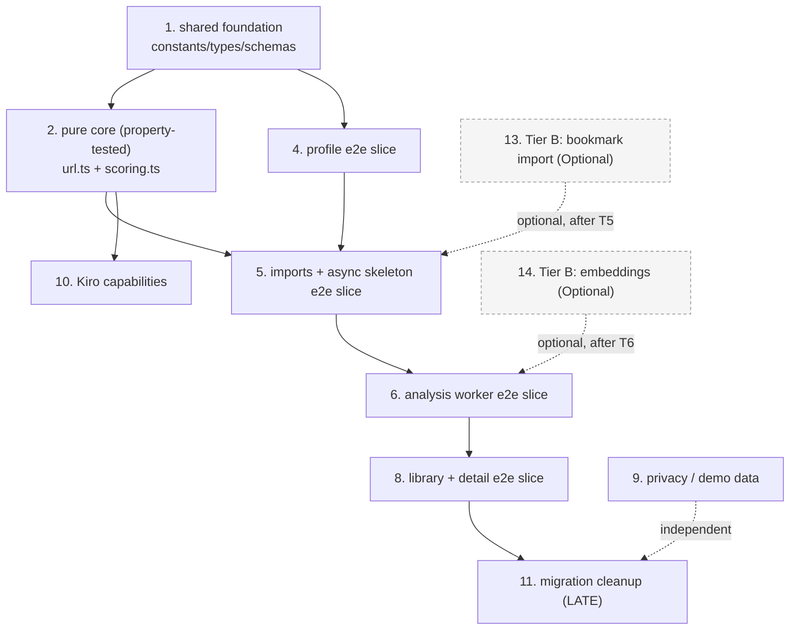

# Implementation Plan: Knowledge Inbox Zero

## Overview

This plan builds Knowledge Inbox Zero as a sequence of vertical, deployable slices on top of the existing serverless monorepo starter. Each slice keeps `npm run build` and `npm run validate` green and leaves the app deployable (NFR-4.3). The pure deterministic core (canonicalization + MKV scoring) is built test-first with fast-check property tests (Properties 1–16) before it is wired into infrastructure. The example `items`/`shares` domain is left in place and removed only as a late migration task once the new domain ships green; the `users` admin domain is kept unchanged.

Implementation language: **TypeScript** (matches the repo stack — Node 22 ARM64 ESM, AWS SDK v3, Zod). Local `.ts` imports use `.js` extensions per repo convention.

Slice ordering: `shared foundation → pure core (property-tested) → profile e2e → imports+async skeleton e2e → analysis worker e2e → library+detail e2e → privacy/demo → Kiro capabilities → migration cleanup → optional Tier B`.

## Tasks

- [x] 1. Foundation: extend `@app/shared` with domain constants, types, and schemas
  - [x] 1.1 Add domain constants to `shared/src/constants.ts`
    - Add `RECOMMENDATION_STATE = ['READ','SKIM','SKIP']` + `RecommendationState` type, `RECOMMENDATION_TAG = ['REDUNDANT','OUTDATED','REFERENCE','FRESH']` + type, `DIFFICULTY = ['INTRO','INTERMEDIATE','ADVANCED','EXPERT']` + type, `DOC_STATUS = ['pending','processing','completed','failed']` + type, `BATCH_STATUS = ['processing','finished']` + type
    - Add `PROFILES`, `BATCHES`, `DOCUMENTS` to `TABLE_NAMES`; keep `ITEMS`/`SHARES` until migration
    - _Requirements: 6.1, 3.\*, 7.1; Design: Data Models (constants additions)_
  - [x] 1.2 Add domain interfaces to `shared/src/types.ts`
    - Add `Profile`, `Scores`, `DocMetadata`, `Extraction`, `KnowledgeDocument`, `RejectedEntry`, `Batch`, `LibraryResponse` exactly as specified in the design; keep existing `Item`/`Share` types until migration
    - _Requirements: 1.*, 5.*, 6.*, 7.*; Design: Data Models (@app/shared TypeScript interfaces)_
  - [x] 1.3 Add Zod schemas to `shared/src/schemas.ts`
    - Add `profileSchema` (trim entries, drop empties, ≤100 entries, ≤200 chars/entry, context ≤5000 chars) using `entryList`/`trimmedEntry` helpers, `importCreateSchema` (`urls` blob, min 1), `libraryQuerySchema` (`state` enum optional, `cursor` optional); export inferred input types; keep item schemas until migration
    - _Requirements: 1.1, 1.5, 1.7, 1.8, 2.1, 7.5; Design: @app/shared Zod schemas_
  - [x] 1.4 Re-export new symbols from `shared/src/index.ts` and build shared
    - Ensure `make build-shared` / `npm run build -w shared` succeeds so backend/frontend can import the new symbols
    - _Requirements: NFR-4.2; Design: Data Models_

- [x] 2. Pure deterministic core in `@app/shared` (test-first with fast-check)
  - [x] 2.1 Add `fast-check` as a backend dev dependency
    - Install pinned `fast-check` under `backend` devDependencies; confirm it runs under the existing Jest/ts-jest ESM setup
    - _Requirements: NFR-4.1; Design: Testing Strategy (property-based testing)_
  - [x] 2.2 Implement URL canonicalization in `shared/src/url.ts`
    - Implement `canonicalizeUrl(raw)` (lowercase scheme/host, strip default ports, drop fragment, remove tracking params via denylist, sort remaining params, normalize trailing slash, prepend `https://` when scheme absent, throw on invalid) and `deriveDocumentId(ownerId, canonicalUrl)` = `sha256Hex(ownerId#canonicalUrl)`; export from `index.ts`
    - _Requirements: 4.1, 2.5, 2.6, 2.8; Design: URL canonicalization_
  - [x]* 2.3 Property tests for canonicalization + document id
    - **Property 2: Idempotent, deterministic canonicalization** — `canonicalizeUrl(canonicalizeUrl(u)) === canonicalizeUrl(u)`
    - **Property 3: No duplicate documents** — same canonical URL for one owner yields one colliding `documentId`
    - **Validates: Requirements 4.1, 2.5, 2.6, 2.8**
  - [x]* 2.4 Golden/edge unit tests for canonicalization
    - Tricky URLs: tracking params, default ports, fragments, missing scheme, trailing slash on root vs path, invalid input throws
    - _Requirements: 4.1, 2.4, 2.5_
  - [x] 2.5 Implement MKV scoring in `shared/src/scoring.ts` (or `backend/src/lib/scoring.ts`)
    - Implement `normalizeConcepts`, `coverage`, `computeRelevance`, `computeNovelty`, `computeRedundancy`, `computeFreshness`, `computeMkv`, and `scoresToRecommendationState` exactly per the design (clamp 0..100, exact-dup ≥90, all-known ≥80, half-life freshness with injected `now`, complement novelty/redundancy, 34/67 state thresholds, tags); export from `index.ts`
    - _Requirements: 5.1–5.9, 6.1; Design: Concept-set math, MKV scoring, Recommendation state mapping_
  - [x]* 2.6 Property tests for scoring bounds and monotonicity
    - **Property 1: Score bounds** — every score in 0..100. **Validates: Requirements 5.1**
    - **Property 12: MKV monotonicity** — non-decreasing in relevance/novelty, non-increasing in redundancy. **Validates: Requirements 5.5**
  - [x]* 2.7 Property tests for novelty/redundancy invariants
    - **Property 7: Knowing more never increases novelty. Validates: Requirements 5.7**
    - **Property 8: Novelty/redundancy complementarity. Validates: Requirements 5.6**
    - **Property 4: Exact duplicates are not low-redundancy (≥90). Validates: Requirements 5.4**
    - **Property 13: All-known implies high redundancy (≥80). Validates: Requirements 5.3**
  - [x]* 2.8 Property tests for freshness and recommendation state
    - **Property 6: Age never improves freshness. Validates: Requirements 5.8**
    - **Property 14: Missing date yields neutral estimated freshness (50 + flag). Validates: Requirements 5.9**
    - **Property 9: Single recommendation state. Validates: Requirements 6.1**
    - **Property 5: Redundant implies not maximally novel and never routes to READ. Validates: Requirements 5.6, 6.1**
  - [x]* 2.9 Example/edge unit tests for state mapping and Zod bounds
    - State-mapping boundaries at 34/67 and fully-redundant → SKIP; Zod: context 5000/5001, lists 100/101 entries and 200/201 chars, invalid `state` filter
    - _Requirements: 6.1, 1.5, 1.8, 7.5_

- [x] 3. Checkpoint — pure core green
  - Ensure all shared/backend unit and property tests pass and `npm run validate` is green. Ask the user if questions arise.

- [ ] 4. Profile vertical slice (end-to-end, deployable)
  - [x] 4.1 Implement `backend/src/handlers/profile.ts`
    - Single `handler` dispatching on method: `GET /profile` returns the caller's profile or the synthetic empty `notConfigured` profile (Req 1.4); `PUT /profile` validates via `parseBody(event, profileSchema)`, trims/drops empties, replaces all fields, stamps server `updatedAt` (UTC, Req 1.3/1.9); scope every read/write to `ctx.sub`; use `authenticate`, `response.ts` helpers, `ddb`, `TABLE_NAMES.PROFILES`, `now()`
    - _Requirements: 1.1–1.9; Design: profile handler, API Surface_
  - [x]* 4.2 Unit tests for profile handler
    - Empty-profile default, replace semantics, validation rejection (context/list bounds), owner isolation
    - _Requirements: 1.2, 1.4, 1.5, 1.6, 1.8_
  - [x] 4.3 Add the `profiles` table to `storage-stack.ts`
    - PK `userId`, no SK/GSI, PAY_PER_REQUEST, DEFAULT encryption, PITR on, `RETAIN`; expose in the `Tables` interface
    - _Requirements: 7.1, NFR-1.1; Design: Infrastructure Changes (storage)_
  - [x] 4.4 Wire `profileFn` + routes + grants in `api-stack.ts`
    - `fn('ProfileFn','profile.ts')`, `grantReadWriteData(profiles)`, routes `GET`/`PUT /profile`, add `TABLE_PROFILES` to `commonEnv`
    - _Requirements: 1.\*; Design: Infrastructure Changes (api)_
  - [x] 4.5 Frontend Profile page
    - Add `frontend/src/pages/app/ProfilePage.tsx` (or extend existing) to create/edit the profile via `lib/api.ts` (shared retry/backoff client) reading session from `AuthContext`; empty state prompts creation (Req 8.2); register the route in `App.tsx`
    - _Requirements: 8.1, 8.2, 8.12; Design: Components_
  - [ ]* 4.6 Frontend Profile page tests (Vitest + Testing Library)
    - Empty state, save flow, validation error rendering
    - _Requirements: 8.1, 8.2_

- [x] 5. Imports + async skeleton vertical slice (end-to-end, deployable)
  - [x] 5.1 Implement `backend/src/handlers/imports.ts`
    - `POST /imports`: normalize lines (trim, drop blanks), reject empty (Req 2.3) and >500 post-normalization (Req 2.7) with `badRequest`, canonicalize + dedup within submission and against existing owned documents (Req 2.6/2.8), create `Batch` with initial counters (Req 2.2) + new `Document`s in `pending`, record `rejected[]` (Req 2.4), enqueue one SQS message per new document, return `201` within 3s (Req 3.1). `GET /imports/{batchId}` returns counts+status (Req 3.3/8.11). `GET /imports` lists caller's batches via `byOwner` GSI. Deterministic only — never calls Bedrock
    - _Requirements: 2.1–2.8, 3.1, 3.2; NFR-2; Design: imports handler_
  - [x]* 5.2 Unit/property tests for import line partition
    - **Property 15: Import line partition** — accepted are valid post-normalization URLs, rejected recorded with reason, no line both, blanks discarded. **Validates: Requirements 2.1, 2.4**
    - Example tests: empty submission rejected, 500/501 cap, within-submission dedup
    - _Requirements: 2.3, 2.6, 2.7_
  - [x] 5.3 Add `batches` + `documents` tables and content S3 bucket to `storage-stack.ts`
    - `batches` PK `batchId` + GSI `byOwner` (PK `ownerId`, SK `createdAt`); `documents` PK `documentId` + GSIs `byOwner` (PK `ownerId`, SK `documentId`), `byOwnerState` (PK `ownerId`, SK `stateKey`), `byBatch` (PK `batchId`, SK `documentId`); private content bucket (Block Public Access, SSE-S3, `RETAIN`); expose in `Tables`/stack outputs
    - _Requirements: 7.1, 4.7, NFR-1.1; Design: Infrastructure Changes (storage), S3 layout_
  - [x] 5.4 Add SQS analysis queue + DLQ and wire `importsFn` in `api-stack.ts`
    - Create `analysis` queue + `analysis-dlq` (`maxReceiveCount: 3`, Req 3.7), visibility timeout ≥ 6× worker timeout; `importsFn` grants `grantReadWriteData(batches)`/`grantReadWriteData(documents)` + `grantQueryIndexes` for `byOwner` + `queue.grantSendMessages`; routes `POST /imports`, `GET /imports`, `GET /imports/{batchId}`; add table/queue env vars
    - _Requirements: 2.\*, 3.1, 3.2, 3.7; Design: Infrastructure Changes (api, SQS)_
  - [x] 5.5 Frontend Add Content page + batch progress polling
    - `frontend/src/pages/app/AddContentPage.tsx`: textarea for newline URLs, submit as one batch via `lib/api.ts`; reject with retained text + error when no valid URL (Req 8.4); show live progress counts polling `GET /imports/{batchId}` at ≤5s and STOP polling at terminal state (Req 8.11); register route in `App.tsx`
    - _Requirements: 8.3, 8.4, 8.11, 8.12, 3.5; Design: Components_
  - [x]* 5.6 Integration test for async boundary
    - `POST /imports` returns quickly with `pending` status and does not await document analysis
    - _Requirements: 3.1, NFR-2_

- [x] 6. Analysis worker vertical slice (end-to-end, deployable)
  - [x] 6.1 Add justified retrieval dependencies
    - Add `@mozilla/readability` + `jsdom` to `backend` dependencies (justified: standard readability stack, no headless browser)
    - _Requirements: 4.2, 4.5, NFR-5; Design: Content retrieval + readability, Design Decisions (OD-5)_
  - [x] 6.2 Implement content retrieval + readability helper
    - `retrieveReadable(url)` in `backend/src/lib`: `fetch` with 15s `AbortController` (Req 4.4), reject non-HTML/text content-type, dead links, empty text → `degraded` with reason; extract metadata (title/author/sourceDomain/publishedAt when present) via `@mozilla/readability` + `jsdom` (Req 4.2)
    - _Requirements: 4.2, 4.4, 4.5, NFR-5_
  - [x] 6.3 Implement Bedrock extraction + explanation helpers
    - `bedrockExtract` (prompt → minified JSON validated by `extractionResponseSchema`, bounded 2× retry → throw so pipeline marks degraded), `bedrockExplain` (50..1500 chars covering why-it-matters/what-is-new/why-this-state); model id from `BEDROCK_MODEL_ID` env; single provider, no multi-provider abstraction
    - _Requirements: 4.3, 4.8, 6.2, 6.6, NFR-1.2; Design: Bedrock extraction contract_
  - [x] 6.4 Implement `backend/src/handlers/analysis-worker.ts` pipeline
    - SQS-triggered with `reportBatchItemFailures`: set `pending→processing` (atomic `ADD` counters), `retrieveReadable`, truncate text >200k (`truncated`, Req 4.6), `bedrockExtract` (degrade on failure), S3 offload when content >300KB storing `s3ContentRef` (Req 4.7), score via the pure core, `scoresToRecommendationState`, `bedrockExplain` (placeholder + `explanationUnavailable` on failure/short, Req 6.6), `persistCompleted`, atomic counter move to `completed`/`failed`, `bumpStateCount`, `maybeFinishBatch` (conditional write); on error mark doc `failed` with reason, move counters, then rethrow for SQS redrive (Req 3.6, 3.7, 3.9)
    - _Requirements: 3.3, 3.6, 3.7, 3.8, 3.9, 3.10, 4.5, 4.6, 4.7, 4.8, 5.\*, 6.1, 6.6; Design: Analysis worker pipeline, Atomic batch counters_
  - [x] 6.5 Wire `analysisWorkerFn` in `api-stack.ts`
    - `NodejsFunction` with SQS event source (batch size 1–5, `reportBatchItemFailures`), 120s timeout, 1024MB, reserved concurrency (e.g. 5); grants `grantReadWriteData(documents)`/`grantReadWriteData(batches)`, `grantReadData(profiles)`, content bucket `grantReadWrite`, GSI query grants, IAM `bedrock:InvokeModel` scoped to the configured model ARN; env `BEDROCK_MODEL_ID`, table/bucket names, `EMBEDDINGS_ENABLED=false`; not exposed via API Gateway
    - _Requirements: 3.7, 3.9, 4.7, 4.8, NFR-1.2, NFR-3; Design: Infrastructure Changes (worker)_
  - [x]* 6.6 Property test for batch count conservation
    - **Property 10: Batch count conservation** — `pending+processing+completed+failed == total`, total immutable, finished iff `pending+processing==0`. **Validates: Requirements 2.2, 3.3, 3.8, 3.10 (CP-10)**
  - [x]* 6.7 Unit tests for worker degradation, truncation, and S3 offload
    - Degraded path produces a recommendation from metadata only (Req 4.5); truncation at 200k (Req 4.6); S3 offload at 300KB with mocked S3; explanation placeholder path (Req 6.6)
    - _Requirements: 4.5, 4.6, 4.7, 6.6_
  - [x]* 6.8 Integration test for resilience + batch finish
    - A forced-failure document does not stop the batch; batch reaches `finished` with correct `failed` count; all-failed still finishes (Req 3.10)
    - _Requirements: 3.6, 3.8, 3.10, NFR-5_
  - [x]* 6.9 CDK assertions (Template.fromStack)
    - Assert tables + GSIs exist, worker timeout 120s, DLQ `maxReceiveCount = 3`, content bucket blocks public access, IAM includes `bedrock:InvokeModel`
    - _Requirements: 3.7, 4.7, NFR-1.1, NFR-3_

- [x] 7. Checkpoint — async pipeline green
  - Ensure all backend unit/property/integration tests and CDK assertions pass and `npm run validate` is green. Ask the user if questions arise.

- [x] 8. Library + document detail vertical slice (end-to-end, deployable)
  - [x] 8.1 Implement `backend/src/handlers/documents.ts`
    - `GET /documents`: return caller's documents grouped with per-state counts + total over the ENTIRE owned set (from the `COUNTS#<ownerId>` aggregate item, pagination-independent, Req 7.2/7.3/7.7), page ≤100 with `nextCursor` via `byOwner`, optional `?state=` filter validated against the taxonomy via `byOwnerState` (invalid → 400, Req 7.5). `GET /documents/{documentId}`: detail (metadata/summary/scores/state/explanation), 404 when missing or not owned (Req 7.9). Deterministic; never calls Bedrock
    - _Requirements: 7.2–7.9, 6.7, 6.8; Design: documents handler, API Surface_
  - [x]* 8.2 Property/round-trip tests for library and persistence
    - **Property 16: Library grouping and pagination integrity** — counts/total reflect full set regardless of pagination; pages ≤100 union to full set without dup/omission; state filter returns only owned in-state docs. **Validates: Requirements 7.2, 7.3, 7.4, 7.7**
    - **Property 11: Round-trip persistence** — write/read yields equivalent object (scores/state/tags/explanation). **Validates: Requirements 6.7, 7.1 (CP-11)**
  - [x] 8.3 Wire `documentsFn` + routes + grants in `api-stack.ts`
    - `fn('DocumentsFn','documents.ts')`, `grantReadData(documents)` + `grantQueryIndexes` for `byOwner`/`byOwnerState`; routes `GET /documents`, `GET /documents/{documentId}`
    - _Requirements: 7.\*; Design: Infrastructure Changes (api)_
  - [x] 8.4 Frontend Library page
    - `frontend/src/pages/app/LibraryPage.tsx`: list analyzed documents grouped/filterable by state with per-state counts, Attention_Saved surfaced prominently (Req 8.10); loading indicator (Req 8.7); empty state with no per-state list (Req 8.6); error + retry after exhausted retries (Req 8.8); use shared `lib/api.ts`; register route in `App.tsx`
    - _Requirements: 8.5, 8.6, 8.7, 8.8, 8.10, 8.12; Design: Components_
  - [x] 8.5 Frontend Document Detail page
    - `frontend/src/pages/app/DocumentDetailPage.tsx`: show what the content says, what is relevant, what is new, reason for recommendation, and what can be ignored; explanation primary, scores secondary (Req 6.8); register route in `App.tsx`
    - _Requirements: 8.9, 6.8; Design: Components_
  - [x]* 8.6 Frontend Library/Detail tests (Vitest + Testing Library)
    - Empty/loading/error+retry states (Req 8.6/8.7/8.8) and polling stop at terminal state (Req 8.11)
    - _Requirements: 8.6, 8.7, 8.8, 8.11_

- [x] 9. Privacy and demo data
  - [x] 9.1 Add clearly-synthetic example data and gitignore guard
    - Add `examples/sample-profile.json` (fictional interests) and `examples/sample-urls.txt` (public documentation URLs), documented as demo-only; ensure `.gitignore` excludes real personal-data files; no real personal data committed (NFR-3.2)
    - _Requirements: NFR-3.1, NFR-3.2, NFR-3.3_

- [x] 10. Kiro capabilities (genuine fits only)
  - [x] 10.1 Add repo-convention + cost-guardrail steering file
    - `.kiro/steering/` note capturing one-handler-per-domain, `response.ts`/`parseBody`/`authenticate` usage, ARM64/Node22 ESM, `@app/shared` placement, deterministic-first / no always-on infra / no vector DB in V1
    - _Requirements: NFR-1.*, NFR-4.*; Design: Kiro Capability Opportunities_
  - [x]* 10.2 Add hooks for tests-on-save and personal-data pre-commit guard
    - Hook to run scoring/url tests on save of `scoring.ts`/`url.ts`; pre-commit guard that fails if a file matching personal-data patterns is staged (NFR-3.2)
    - _Requirements: NFR-3.2; Design: Kiro Capability Opportunities_

- [x] 11. Migration cleanup (LATE — only after the new domain ships green)
  - [x] 11.1 Remove the example `items`/`shares` domain
    - Delete `items.ts`/`shares.ts` handlers and their routes/grants/tables (storage + api stacks), remove `Item`/`Share` types, schemas, `ITEMS`/`SHARES` from `TABLE_NAMES`, and their tests and the `ItemsPage`; keep the `users` admin domain unchanged; ensure `npm run build` and `npm run validate` stay green
    - _Requirements: NFR-4.3; Design: Design Decisions (migration note)_

- [~] 12. Final checkpoint
  - Ensure the full `npm run validate` (build shared + lint + css + typecheck + format + tests) is green and the stacks synth. Ask the user if questions arise.

- [ ] 13. Optional Tier B — Bookmark HTML import (client-side) _Optional_
  - [ ]* 13.1 Client-side bookmark HTML parsing _Optional_
    - In the frontend, parse a standard browser bookmarks HTML file client-side (never upload the file), submit extracted URLs through the same Batch mechanism, reject unrecognized formats with the expected-format message
    - _Requirements: 9.1, 9.2, 9.3_

- [ ] 14. Optional Tier B — Embeddings-based novelty _Optional_
  - [ ]* 14.1 Embeddings behind `EMBEDDINGS_ENABLED` _Optional_
    - When enabled, compute a per-document embedding to refine Novelty/Redundancy against prior documents; when disabled, use the deterministic concept-based path; fall back to concept-based scoring and record unavailability on embedding failure. No vector DB required for V1 default (flag defaults off)
    - _Requirements: 10.1, 10.2, 10.3_

## Notes

- Tasks marked with `*` are optional test/quality sub-tasks and may be skipped for a faster MVP; core implementation tasks are never optional.
- Tasks 13 and 14 are Tier B stretch and are marked `_Optional_`; V1 does not require them.
- Every slice (4, 5, 6, 8) is end-to-end (shared → backend → CDK → frontend) and keeps `npm run build`/`npm run validate` green and the app deployable (NFR-4.3).
- The pure core (task 2) is built test-first with fast-check Properties 1–16 mapping to CP-1..CP-11 plus requirement-specific invariants; it is pure logic with no infra so it is fully green before any wiring.
- Deploy verification is done through CDK assertions (task 6.9), not manual steps.
- The `items`/`shares` example domain is removed only in task 11, after the new domain ships green.

## Task Dependency Graph



```json
{
  "waves": [
    { "id": 0, "tasks": ["1.1", "1.2", "1.3"] },
    { "id": 1, "tasks": ["1.4", "2.1"] },
    { "id": 2, "tasks": ["2.2", "2.5"] },
    { "id": 3, "tasks": ["2.3", "2.4", "2.6", "2.7", "2.8", "2.9"] },
    { "id": 4, "tasks": ["4.1", "4.3"] },
    { "id": 5, "tasks": ["4.2", "4.4", "4.5"] },
    { "id": 6, "tasks": ["4.6", "5.1", "5.3"] },
    { "id": 7, "tasks": ["5.2", "5.4", "5.5"] },
    { "id": 8, "tasks": ["5.6", "6.1", "6.2", "6.3"] },
    { "id": 9, "tasks": ["6.4"] },
    { "id": 10, "tasks": ["6.5"] },
    { "id": 11, "tasks": ["6.6", "6.7", "6.8", "6.9"] },
    { "id": 12, "tasks": ["8.1"] },
    { "id": 13, "tasks": ["8.2", "8.3"] },
    { "id": 14, "tasks": ["8.4", "8.5"] },
    { "id": 15, "tasks": ["8.6", "9.1", "10.1", "10.2"] },
    { "id": 16, "tasks": ["11.1"] },
    { "id": 17, "tasks": ["13.1", "14.1"] }
  ]
}
```
