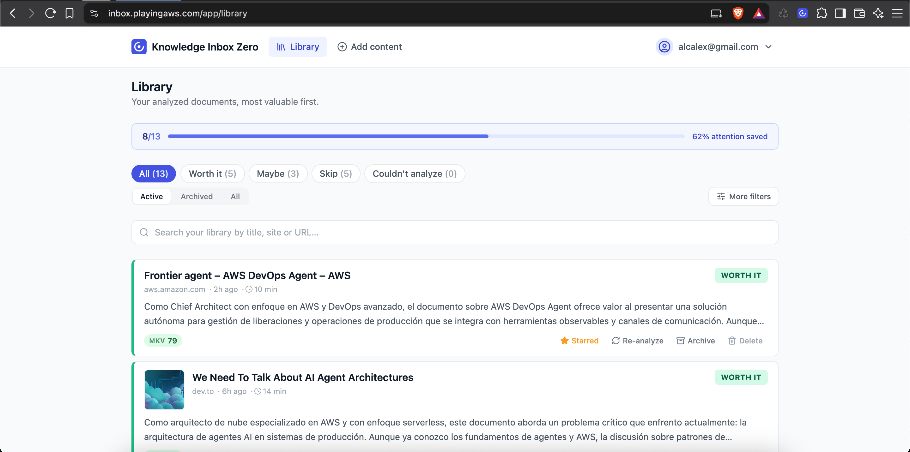
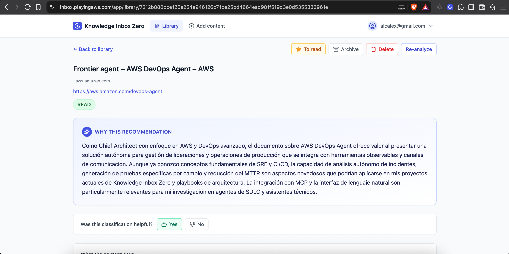
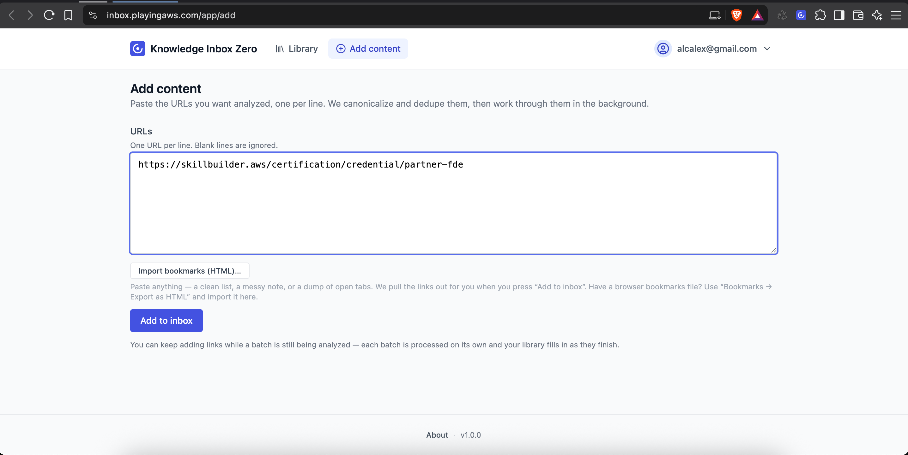
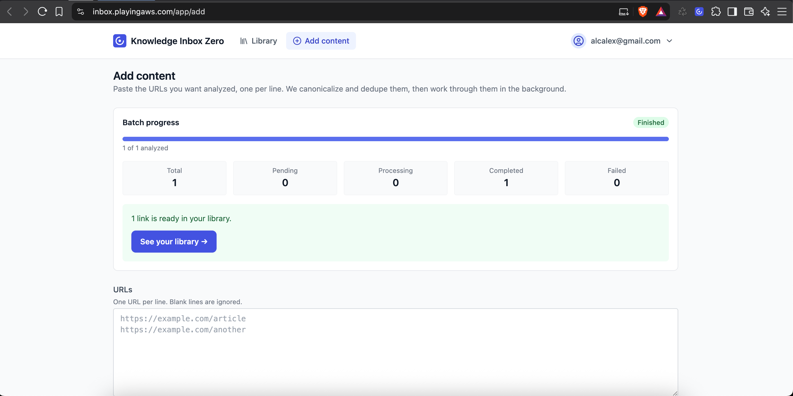
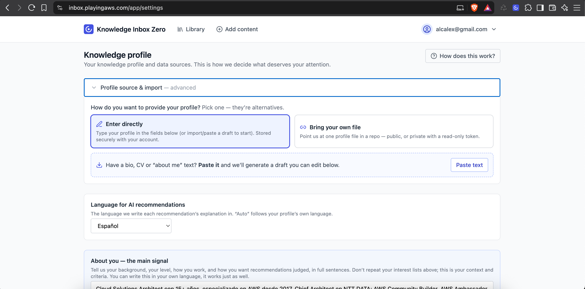
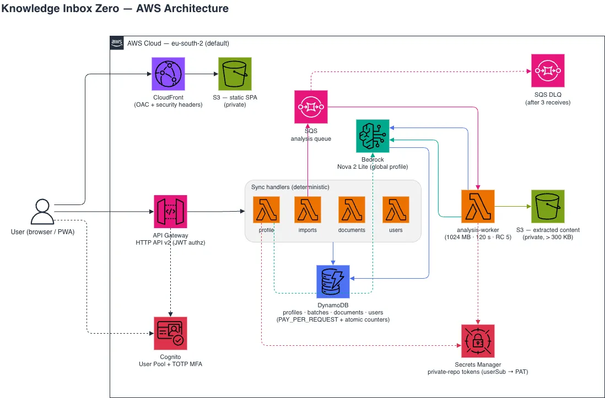

<div align="center">

# Knowledge Inbox Zero

**Inbox zero, for your reading list.** Paste the links you keep meaning to read — get back the small subset that actually deserves your attention, and _why_.

It optimizes for **attention saved**, not content stored.

🌐 [Live app](https://inbox.playingaws.com) · 📦 [Install / self-host](INSTALL.md) · 🔌 [MCP & agents](docs/mcp.md)

[](https://github.com/alazaroc/knowledge-inbox-zero/actions/workflows/pipeline.yml)
[](LICENSE)


</div>

> **Not** a bookmark manager, **not** a read-it-later app, **not** an RSS reader. It doesn't help you save more — it helps you read less, on purpose.

## Try it

No install, no setup. **[Open the app](https://inbox.playingaws.com)**, sign up with your email, and paste a few links — you'll get back which ones are worth your time, and why.

Want to run your own instance or hack on it? See [INSTALL.md](INSTALL.md) to self-host, or [CONTRIBUTING.md](CONTRIBUTING.md) to develop.

## Why

- **Saves attention, not links.** The headline metric is how much reading you can safely skip, not how much you hoarded.
- **Marginal value, per user.** A great article you already understand scores near zero. Worth is relative to _what you already know_.
- **Explained, never a black box.** Every document gets a written reason — the score is supporting detail, not the verdict.
- **Cheap by design.** Deterministic-first and fully serverless: the LLM runs only where it must, and there is no idle cost when nobody is using it.
- **Private.** Every read and write is scoped to the signed-in user.

## Contents

- [Try it](#try-it)
- [The idea: Marginal Knowledge Value](#the-idea-marginal-knowledge-value)
- [How it works](#how-it-works)
- [Architecture](#architecture)
- [Tech stack](#tech-stack)
- [Run your own / develop](#run-your-own--develop)
- [Integrations (MCP & Kiro Power)](#integrations-mcp--kiro-power)
- [Scope](#scope)
- [Community](#community)
- [License](#license)

## The idea: Marginal Knowledge Value

A document's worth is not its objective quality — it's the **additional** value it gives _you_, given what you already know, what you're researching, and what you've already processed. A great article about something you already understand has near-zero marginal value.

Every analyzed document gets:

- A single **recommendation** — shown in the app as **Worth it**, **Maybe**, or **Skip** (internally `READ` / `SKIM` / `SKIP`). A document that couldn't be fetched or extracted is surfaced separately as **Couldn't analyze**.
- A numeric **MKV score** (0–100) built from relevance, novelty, redundancy, and freshness.
- Advisory **tags** — `REDUNDANT`, `OUTDATED`, `REFERENCE`, `FRESH`.
- A written **explanation** (the primary output; scores are supporting detail).

## How it works

1. **Profile** — You describe your knowledge: high/medium interests, what you're currently researching, what you already know, content types to avoid, and optional free-text context.
2. **Add content** — Paste newline-separated URLs (up to 500) as one persistent **batch**. The request returns in under 3 seconds; nothing blocks while URLs are analyzed.
3. **Async analysis** — Each URL is canonicalized, de-duplicated, fetched best-effort, and run through the pipeline. A bad or unreachable URL never fails the batch; it still produces a recommendation from whatever was obtained.
4. **Library** — Documents are grouped by recommendation with per-state counts, and **attention saved** is surfaced as the headline metric. Open any document for its full explanation.

## Screenshots

▶️ **Watch the 3-minute demo** — profile → import → library → browser extension → MCP from an agent:

[](https://youtu.be/w5zU5v465N4)

The **Library**, newest and most valuable first, with the headline _attention saved_ metric and per-state counts (Worth it / Maybe / Skip):



<details>
<summary><strong>Document detail — the explanation</strong></summary>

> Each document opens to a written **"why this recommendation"**, in your profile's language, with the recommendation state, actions (to-read, archive, re-analyze), and a quick helpful/not-helpful control.



</details>

<details>
<summary><strong>Add content — paste URLs, watch the batch</strong></summary>

> Paste newline-separated URLs (or a messy dump — links are pulled out), press **Add to inbox**, and the batch is analyzed in the background. You can keep adding while it runs.




</details>

<details>
<summary><strong>Knowledge profile — how it decides</strong></summary>

> Your knowledge profile and data sources: type it directly, bring your own file from a repo, or paste a bio/CV to generate a draft. Set the language each explanation is written in.



</details>

## Architecture

Serverless-first on AWS, deterministic-first by design. The LLM is invoked **only** for structured extraction and the written explanation — everything else (canonicalization, dedup, metadata, all MKV math) is pure deterministic code, property-tested once in `@app/shared` and reused by both the API and the worker.



- **Sync handlers** (256 MB, 10 s): `profile`, `imports`, `documents`, `users`. Deterministic — only `profile` touches Bedrock, and only to draft/sync a profile from imported text.
- **`analysis-worker`** (1024 MB, 120 s, reserved concurrency 5): SQS-triggered, the full per-document pipeline — fetch → [Mozilla Readability](https://github.com/mozilla/readability) extraction → Bedrock structured extraction → MKV scoring → Bedrock explanation → persist → atomic DynamoDB counter updates. The only component that writes extracted content to S3.
- **Storage**: DynamoDB (PAY_PER_REQUEST, one table per entity — `profiles`, `batches`, `documents`, `users`) + a private S3 bucket for extracted content over 300 KB. Private-repo profile tokens live in Secrets Manager (one JSON map, `userSub → PAT`).
- **AI**: Amazon Bedrock, single configurable model via `BEDROCK_MODEL_ID` (default `global.amazon.nova-2-lite-v1:0`, Amazon Nova 2 Lite via the GLOBAL inference profile). No vector DB in V1 — novelty/redundancy are computed deterministically from extracted concepts.

## Tech stack

- **Frontend**: React 18 + Vite 8 + TypeScript + Tailwind 3.4, PWA (`vite-plugin-pwa`, `registerType: "prompt"`), AWS Amplify (Cognito) auth, `react-router-dom` v6. Shared API client with retry + exponential backoff.
- **Backend**: AWS Lambda (Node 22, ARM64) in TypeScript ESM, AWS SDK v3 (DynamoDB, SQS, S3, Bedrock Runtime, Cognito), `zod` validation, `aws-jwt-verify`, `@mozilla/readability` + `jsdom`. One handler per domain.
- **Shared** (`@app/shared`): types, constants, zod schemas, and all pure deterministic MKV logic.
- **Infra** (`infra/cdk`): AWS CDK (`aws-cdk-lib` ^2.258) — `storage` (DynamoDB + content bucket), `auth` (Cognito + TOTP MFA), `api` (HTTP API v2 + Lambdas + SQS/DLQ + Bedrock IAM), `frontend` (private S3 + CloudFront with OAC and security headers).
- **Quality**: ESLint 9, Prettier, Stylelint, husky + lint-staged, Jest (backend, with `fast-check` property tests), Vitest (frontend). CI via GitHub Actions + OIDC.

Default region `eu-south-2` (configurable).

```
.
├── shared/             # @app/shared — types, schemas, pure MKV logic (build first)
├── frontend/           # React SPA — pages: Profile, Add Content, Library, Document Detail
├── backend/            # Lambda handlers: profile, imports, documents, analysis-worker, users
├── infra/cdk/          # CDK stacks: storage, auth, api, frontend
├── mcp-server/         # MCP server (stdio) — thin client of the API
├── power/              # Kiro Power — connect any agent to the hosted app
├── browser-extension/  # Optional MV3 extension — one-click "save this tab" (not deployed)
└── Makefile            # unified command interface
```

## Run your own / develop

The project is a reproducible npm-workspaces monorepo on AWS CDK, built to be copied. Full instructions — the hosted app vs. self-hosting, region/model choices, custom domain, and teardown — live in **[INSTALL.md](INSTALL.md)**.

Quick start for local work (requires Node.js ≥ 22; self-hosting also needs an AWS account with CDK bootstrapped and Bedrock model access):

```bash
make install     # npm ci — clean, reproducible install
make build       # build shared + backend + frontend
make validate    # build + lint + css + typecheck + format + tests
make dev         # Vite dev server against the deployed backend
```

`make help` lists every target (deploy, logs, user management, and more). Deploying to your own account and creating the first user is covered step by step in [INSTALL.md](INSTALL.md#option-b--self-host-on-your-own-aws-account).

Two deploy-time knobs: `BEDROCK_MODEL_ID` (the Bedrock model, switchable with a redeploy) and `EMBEDDINGS_ENABLED` (Tier B semantic novelty, off by default). CI runs `lint → test → build` on every push and deploys to `prod` on `main` via OIDC — no stored secrets.

## Integrations (MCP & Kiro Power)

Knowledge Inbox Zero is usable from any MCP-capable agent — ask it "what should I read?" and it submits your links and reads back the recommendations.

- **MCP server** (`mcp-server/`) — a stdio server that is a **thin client** of the deployed API (it does no scoring itself). Three tools, one endpoint each:

  | Tool                   | Endpoint                  | Purpose                                      |
  | ---------------------- | ------------------------- | -------------------------------------------- |
  | `submit_urls`          | `POST /imports`           | Send URLs for asynchronous analysis.         |
  | `list_recommendations` | `GET /documents[?state=]` | List READ/SKIM/SKIP docs with score + title. |
  | `explain_document`     | `GET /documents/{id}`     | Fetch one doc's explanation, scores, state.  |

  Config is environment-only (`KIZ_API_URL` + a Cognito id token, or email/password). Full reference: [docs/mcp.md](docs/mcp.md).

- **Kiro Power** (`power/`) — packages the above as an installable [Agent Plugin](https://agent-plugins.org/) so any Kiro agent can connect to a hosted instance with no access to this repo.

## Scope

- **V1 (built)**: profile, paste-URL import, async analysis, MKV scoring, recommendation + explanation, persistent library, web UI, per-user privacy.
- **Behind flags (stretch)**: client-side bookmark-HTML import, embeddings-based semantic novelty, section-level guidance, user-selectable Bedrock model.
- **Optional component**: a Manifest V3 [browser extension](browser-extension/README.md) to add links faster — one click saves the current tab to your inbox instead of copy-pasting URLs. Not required to use the app and not deployed with it.
- **Out of scope for V1**: full bookmark manager, reader/highlights/annotations, RSS/newsletter ingestion, mobile apps, collaborative libraries, generic chatbot over the library, knowledge graphs, large-scale vector infrastructure.

## Community

This is a community project, and it's meant to be used — not just looked at.

- **Use it.** Try the [hosted app](https://inbox.playingaws.com), free.
- **Run your own.** It's built to be copied: [self-host it](INSTALL.md#option-b--self-host-on-your-own-aws-account) on your own AWS account in about 20 minutes. Your data stays in your account, and you tune the limits.
- **Make it yours.** Fork it, rebrand it, point the browser extension and MCP server at your instance, swap the Bedrock model — it's all configurable without touching the core.
- **Build it with me.** Ideas, bug reports, and pull requests are genuinely welcome. Open an [issue](https://github.com/alazaroc/knowledge-inbox-zero/issues) or a PR — see [CONTRIBUTING.md](CONTRIBUTING.md). If you ship something on top of it, I'd love to hear about it.

The one rule for new ideas: they should sharpen the core question — _what deserves this user's attention, and why?_ — rather than turn it into a general bookmark manager.

---

Built with [Kiro](https://kiro.dev) — spec-driven, with steering, hooks, MCP, a custom review agent, and property-based tests.

## License

MIT — see [LICENSE](LICENSE).
